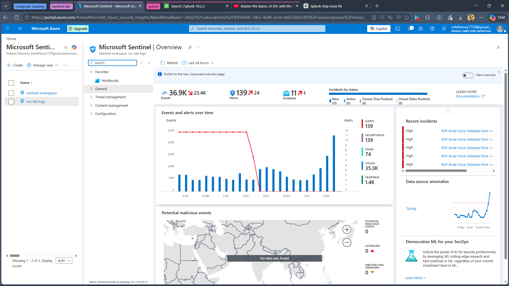
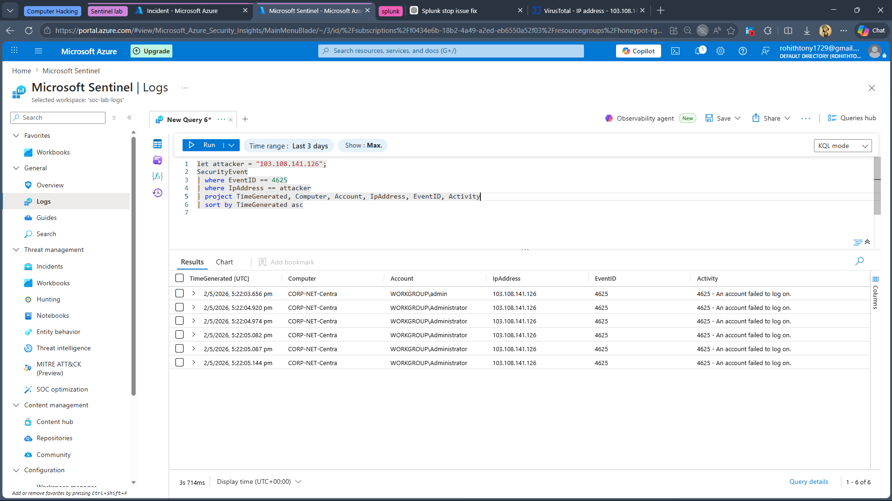
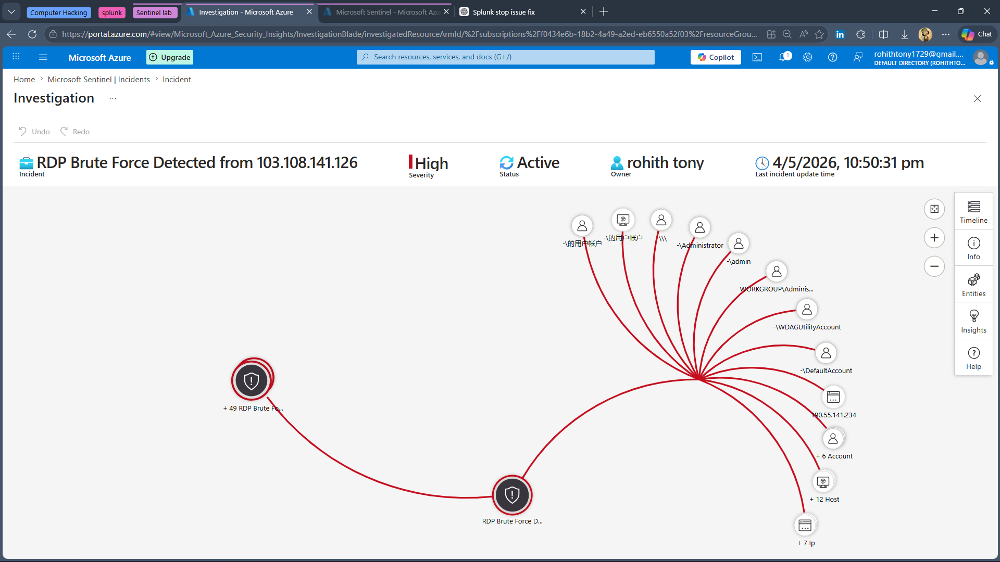
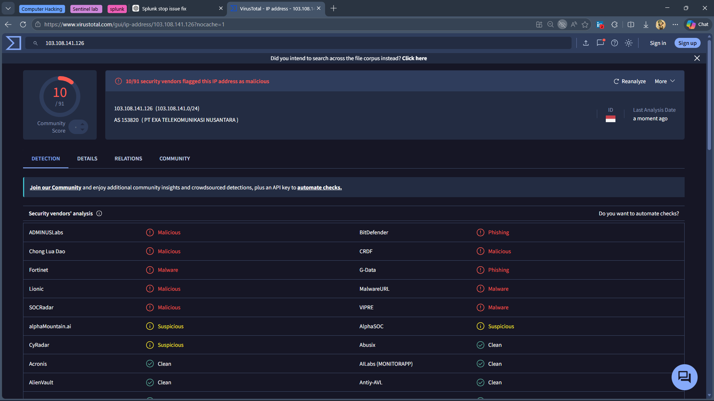
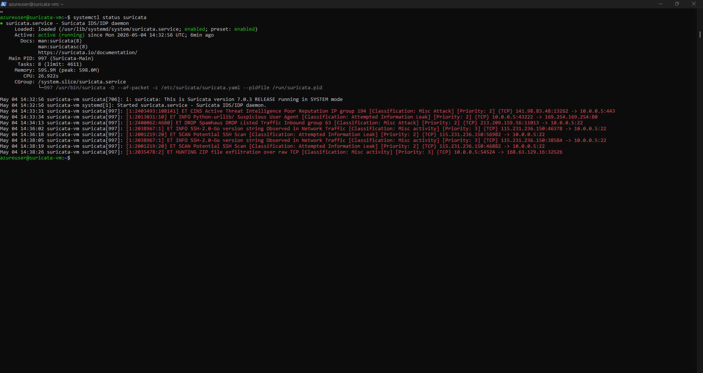
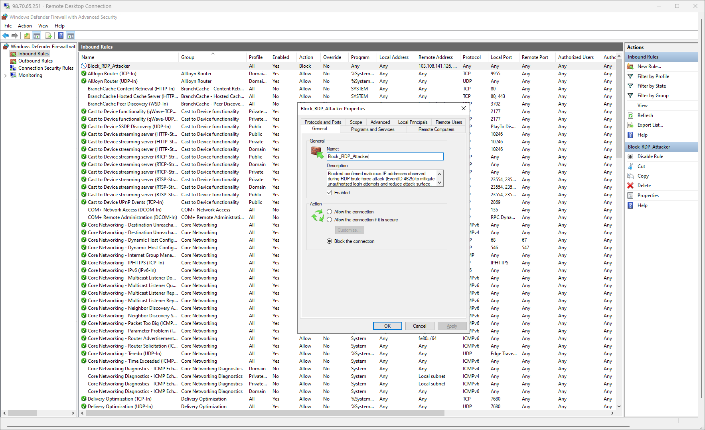
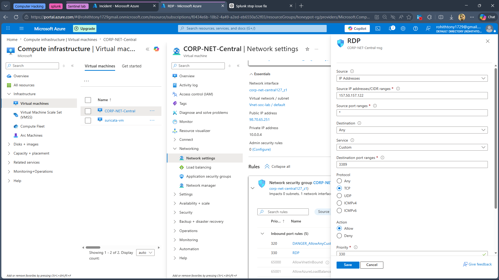
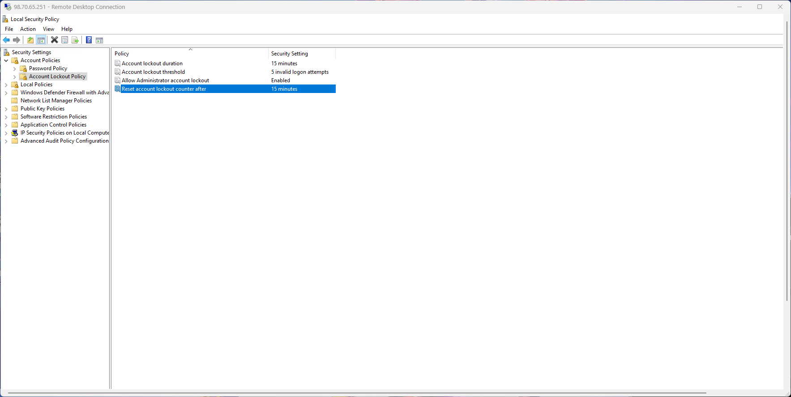

# RDP Brute Force Attack Investigation (Azure Sentinel)

## Overview

This project simulates a real-world SOC Level 1 investigation of an RDP brute force attack using Microsoft Sentinel. The objective was to detect suspicious activity, analyze logs, validate the threat, and apply mitigation steps.

---

## Lab Setup

* Azure Windows Virtual Machine exposed to the internet
* Microsoft Sentinel with Log Analytics workspace
* Suricata IDS on Ubuntu VM
* RDP (Port 3389) enabled

---

## Incident Summary

* **Alert:** RDP Brute Force Detected
* **Severity:** High
* **Source IP:** 103.108.141.126
* **Behavior:** Multiple failed login attempts in a short time

---

## Investigation Process

### 1. Alert Identification

Microsoft Sentinel generated a high-severity alert indicating repeated RDP login failures.

👉 Initial assumption: Possible brute force attack targeting exposed RDP service.



---

### 2. Log Analysis (KQL)

To validate the alert, I queried Windows Security logs for failed login attempts (Event ID 4625) from the suspected IP.

```kql
let attacker = "103.108.141.126";
SecurityEvent
| where EventID == 4625
| where IpAddress == attacker
| project TimeGenerated, Computer, Account, IpAddress, EventID, Activity
```

👉 Observation:

* Multiple failed login attempts recorded
* Same IP targeting different accounts
* Activity occurred within a short time window

👉 Conclusion:
This pattern strongly indicates an automated brute force attempt.



---

### 3. Entity & Impact Analysis

Using Sentinel’s investigation graph, I analyzed affected entities.

👉 Findings:

* Multiple user accounts targeted (including Administrator)
* Single external IP interacting with the system
* No successful login events observed

👉 Conclusion:
Attack was unsuccessful but clearly malicious.



---

### 4. Threat Intelligence Validation

The attacker IP was checked using VirusTotal.

👉 Result:

* Multiple security vendors flagged the IP as malicious

👉 Conclusion:
Confirms external threat actor involvement.



---

### 5. Network-Level Confirmation (Suricata)

Suricata IDS logs showed suspicious inbound traffic patterns.

👉 Insight:

* Indicators of scanning and intrusion attempts detected

👉 Conclusion:
Supports SIEM findings and confirms attack behavior.



---

## Final Assessment

* Confirmed brute force attack targeting RDP
* Attack originated from a known malicious IP
* No successful compromise detected
* System remained secure

---

## Response Actions

### 1. Block Attacker IP

Blocked the malicious IP using Windows Firewall.



---

### 2. Restrict RDP Access

Configured Azure NSG to allow RDP only from trusted IPs.



---

### 3. Strengthen Authentication Controls

Implemented account lockout policy to prevent repeated login attempts.



---

## Key Learnings

* How to investigate brute force attacks using Microsoft Sentinel
* Writing effective KQL queries for detection
* Correlating SIEM alerts with IDS logs
* Validating threats using external intelligence sources
* Applying practical mitigation techniques

---

## Tools Used

* Microsoft Sentinel
* Azure Virtual Machines
* KQL
* Suricata IDS
* VirusTotal
* Windows Defender Firewall

---

## Conclusion

This project demonstrates a complete SOC investigation workflow, including detection, analysis, validation, and response. It reflects practical skills required for a SOC Analyst role.

---
